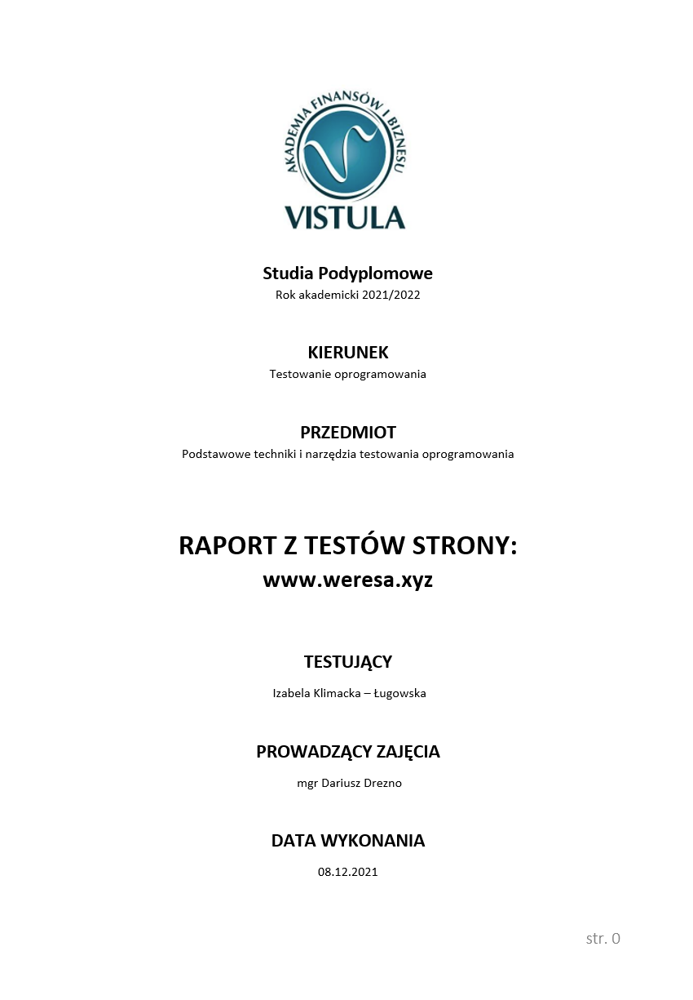

# The designated repository contains documents that I made as part of performing tests on my training.
## Test report

The purpose of the weresa.xyz site test is to find errors on the site, to detect incorrectness, bad user experience, thus minimizing the risk incurred by the site developer. 
At the end of the activities, a report will be created, which should influence the repair of the errors found.
The most important Goal: Influence, if possible, the improvement of the errors found

##### Primary Goals:
- Verify that functionalities are compliant with requirements
- Verification whether functionalities are in line with audience expectations
- Verification whether the user experience while using the site is positive 
- Suggestion for improvement of bugs found culminating in their implementation and retesting

##### Verification of the site for testing:
- Functional
- Non-functional
- Security
- Performance
- Availability

##### Additional Objective:
To gain experience in finding bugs, entering them into the system, retesting and preparing the final report.

